# 166 Inventory

Inventory system for the IT department I work in. We use it to keep track of our equipment: every
laptop, monitor, printer or switch has an inventory code, a department and the person it is given
to, and every time something moves to another department it goes into that device's history.

It is a **modular monolith** on .NET 10 and PostgreSQL. The UI is in Azerbaijani, English and
Russian, works on phones too, and there is a JSON API that our ServiceDesk app uses.

This is the third version of the project:

1. [inventory-system-desktop](https://github.com/yusifbagiyev/inventory-system-desktop) - the first
   one, a Windows Forms app on SQL Server.
2. [Inventory-Management-Microservices](https://github.com/yusifbagiyev/Inventory-Management-Microservices) -
   an earlier version of this web app. I wrote it as microservices (API gateway, RabbitMQ, a database
   per service) mostly to get experience with that architecture.
3. This repository. For an app of this size the microservices were more trouble than they were worth,
   so I merged them into one application but kept the same module boundaries. Things that used to be
   messages between services are now plain transactions, and the deployment went from eleven
   containers to four.

Screenshots are from a demo database with made-up data.

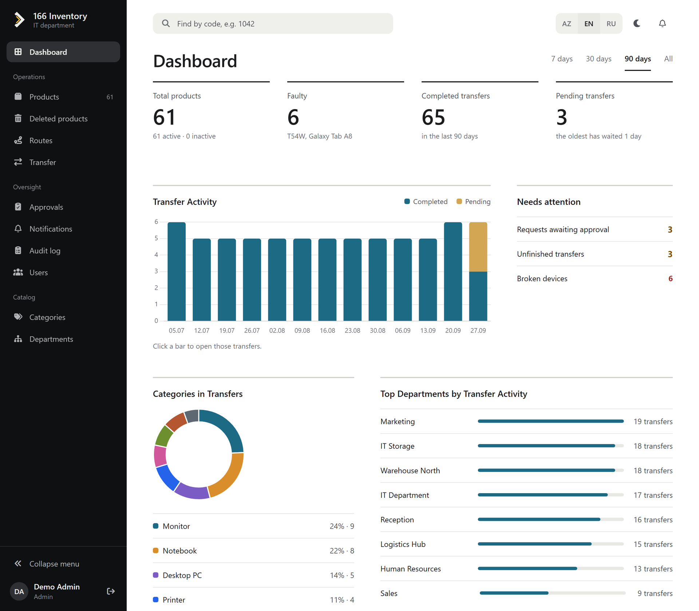

| | |
|---|---|
| 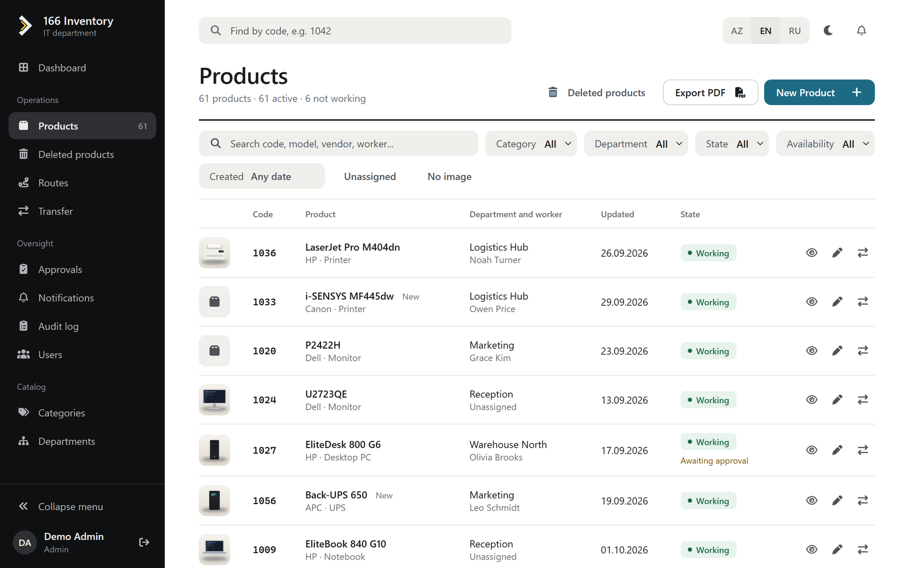 | 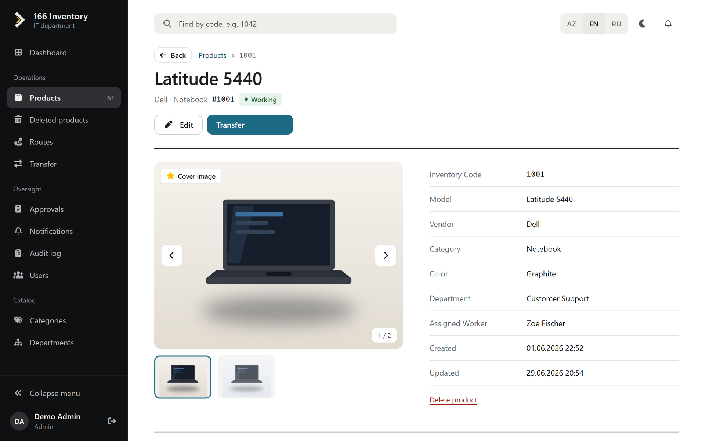 |
| 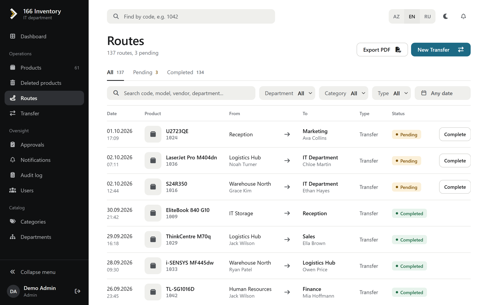 | 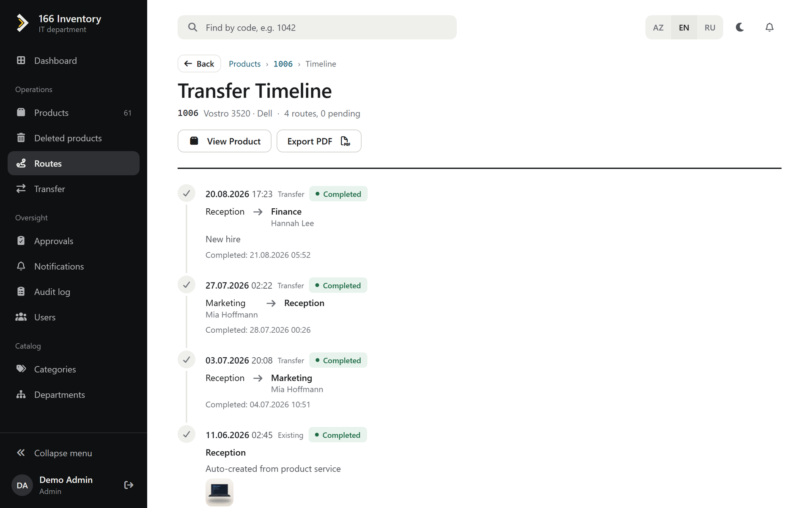 |
| 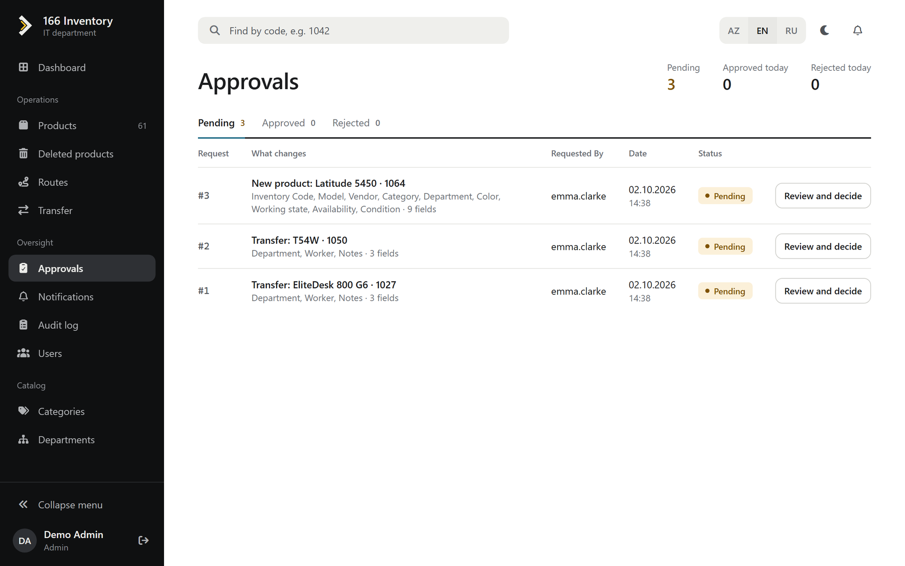 | 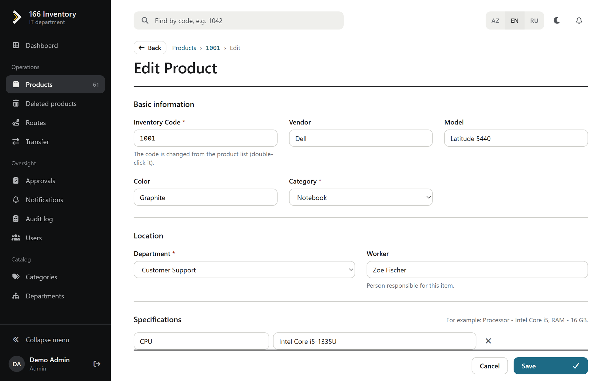 |
| 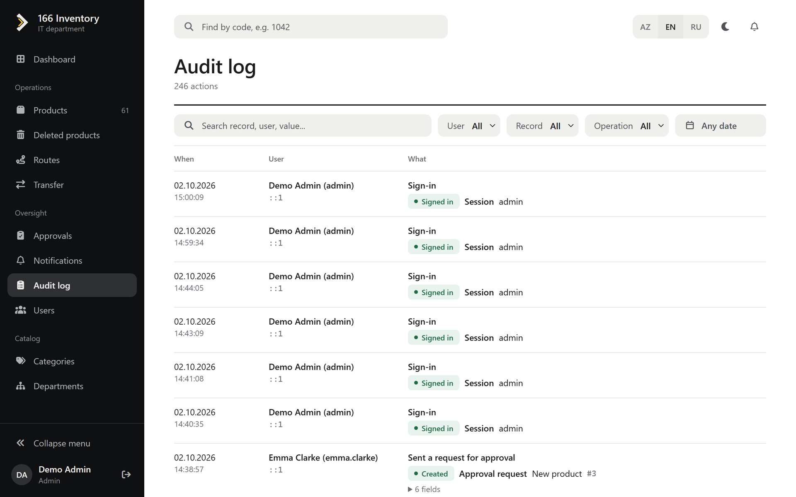 | 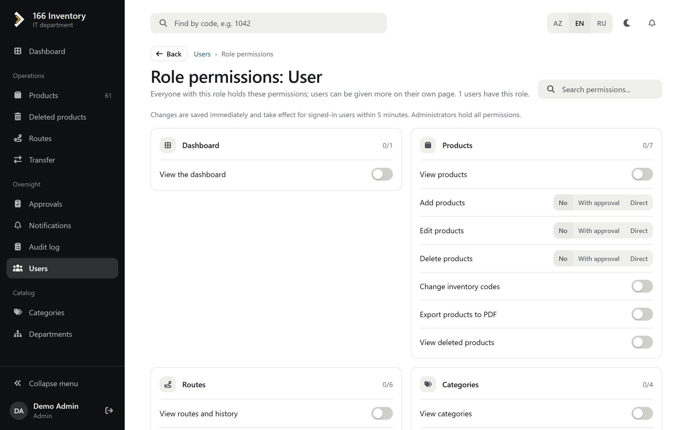 |
| 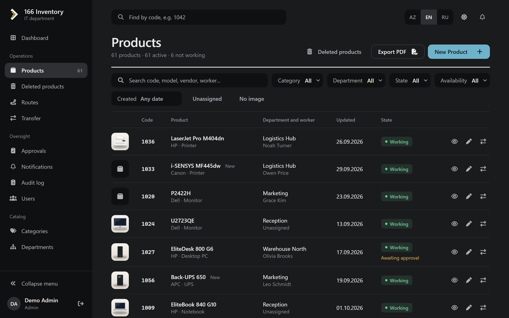 | 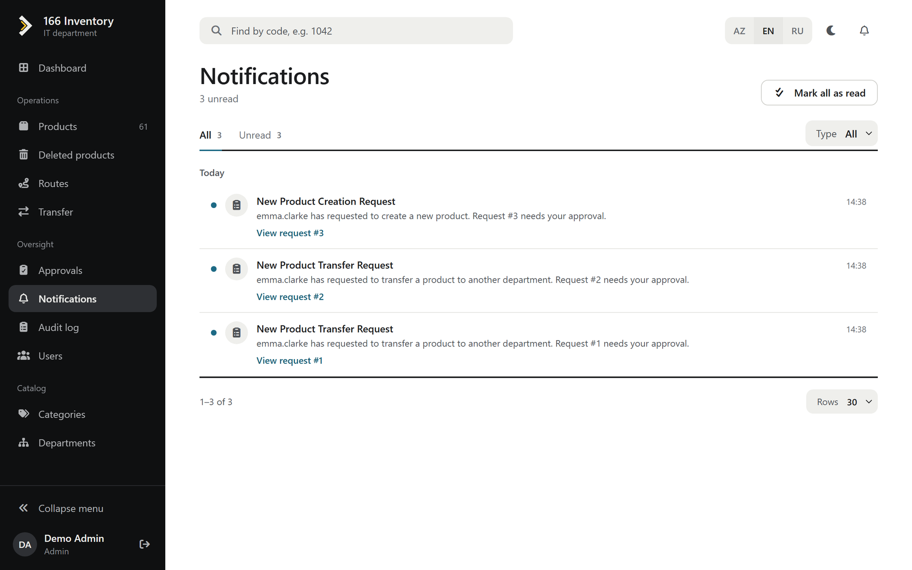 |

<p align="center">
  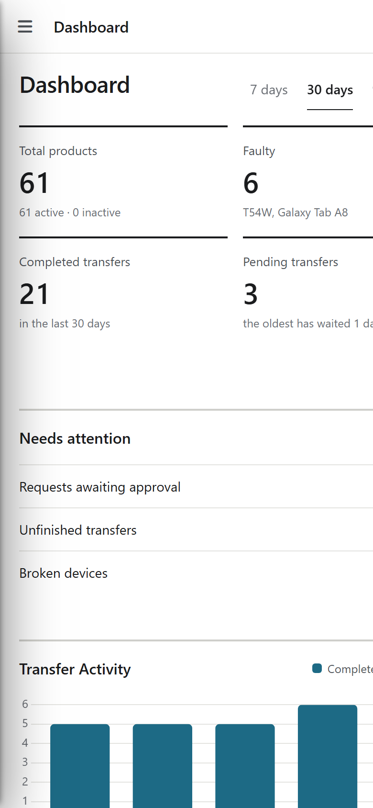
  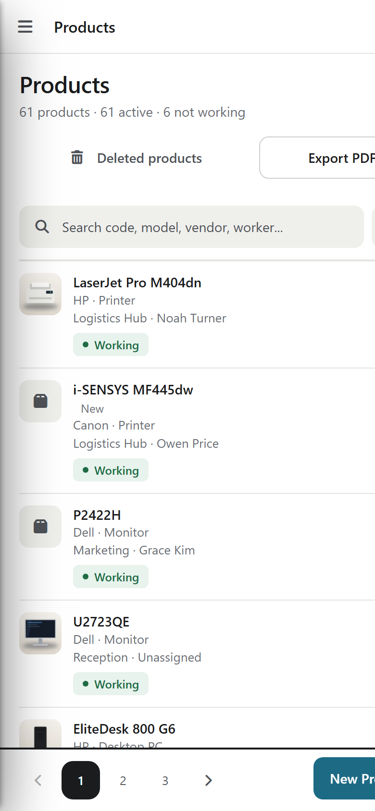
  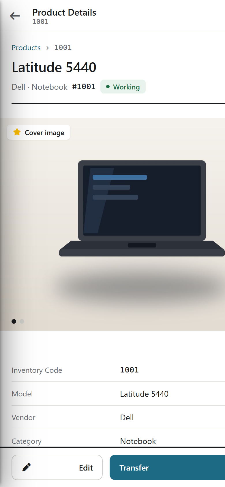
</p>

## What it does

Products have an inventory code, category, department, the person using them, colour, any number of
specifications and photos. Lists can be searched and filtered, exported to PDF, and any device can be
opened from the search box at the top by its code.

Moving a device creates a transfer, which is completed when the device arrives. The product page
shows everything that happened to it: created, edited, moved, deleted. Transfers store the department
and category names as they were at that moment, so renaming a department later doesn't change old
records.

Not everyone can change data directly. Each write permission has two levels: with `product.update`
your change becomes a request that someone has to approve, with `product.update.direct` it is applied
right away. The approver sees exactly which fields change. Nobody can approve their own request.

Other things worth mentioning:

- pages update by themselves when someone else changes a record (SignalR);
- an audit log of every change with the old and new value of each field, who did it and from where;
- notifications in the app, and completed transfers posted to a WhatsApp group;
- roles and per-user permissions, edited by an admin on a simple page;
- dashboard with transfer activity, categories and the most active departments;
- Word export of a department's inventory;
- all frontend libraries are served locally, it doesn't need internet access to work.

## How it is built

```
InventoryManagement.Web        the host: MVC + Razor UI, /api, SignalR hub
├── IdentityService.*          users, roles, permissions, JWT
├── ProductService.*           products, categories, departments, images
├── RouteService.*             transfers and product history
├── ApprovalService.*          approval requests
├── NotificationService.*      notifications, SignalR, WhatsApp
├── AuditService               audit log
└── SharedServices             contracts between modules, events, transactions, auth
```

Each module has its own Domain / Application / Infrastructure / API projects and its own schema in
the database. Commands and queries go through MediatR, validation through FluentValidation. Modules
don't reference each other's internals; they talk through interfaces in `SharedServices/Contracts`
and in-process events. All module DbContexts share one connection per request, so an operation that
touches several modules (approving a request runs the requested action, completing a transfer moves
the product) is a single transaction. The audit log and the live updates are EF Core interceptors.

Stack: ASP.NET Core 10, EF Core 10, PostgreSQL 15, MediatR, FluentValidation, SignalR, Serilog + Seq,
SkiaSharp, Docker, nginx, GitHub Actions. The UI is Razor with Bootstrap, jQuery, DataTables and
Chart.js and a small design system of my own on top (`wwwroot/css`).

Since the app is open to the internet I spent some time on security: sign-in errors don't reveal
whether a user exists, accounts lock after repeated failures and addresses get throttled, changing a
password ends the user's other sessions, refresh tokens are stored hashed, uploaded files are checked
by content and their metadata (GPS etc.) is removed, and the usual headers (CSP and friends) are set.

## Running it

With Docker:

```bash
cp .env.example .env        # set DB_PASSWORD, JWT_SECRET_KEY, ...
docker compose up -d --build
```

Or locally with the .NET 10 SDK and a PostgreSQL server:

```bash
dotnet user-secrets --project InventoryManagement.Web set "ConnectionStrings:DefaultConnection" "Host=localhost;Port=5432;Database=inventory;Username=postgres;Password=<password>"
dotnet user-secrets --project InventoryManagement.Web set "Jwt:Key" "<at least 32 characters>"
dotnet run --project InventoryManagement.Web
```

The app runs at http://localhost:5051 and creates its database on the first start, with roles,
permissions and a demo admin (`admin` / `Admin12345`) seeded in
`IdentityService.Infrastructure/Data/IdentityDbContext.cs` - replace that seed before using it.

To add a migration:

```bash
dotnet ef migrations add <Name> --project ProductService.Infrastructure --startup-project ProductService.Infrastructure
```

UI texts are keyed by their English wording; the translations are in
`InventoryManagement.Web/Resources/i18n/az.json` and `ru.json`.

## API

Everything under `/api` accepts a JWT from `POST /api/auth/login`, an API key (for other systems) or
the browser's cookie. Main endpoints:

- `GET/POST /api/products`, `GET/PUT/DELETE /api/products/{id}`, `GET /api/products/search/inventory-code/{code}`
- `GET/POST /api/categories`, `/api/departments`
- `POST /api/inventoryroutes/transfer`, `PUT /api/inventoryroutes/{id}/complete`
- `GET /api/approvalrequests`, `POST /api/approvalrequests/{id}/approve`, `/reject`
- `POST /api/auth/login`, `/refresh`, `GET /api/auth/me`

The same permission rules apply as in the UI: if your change needs approval you get `202` with the
request id, without permission `403`, and `409` if someone changed the record in the meantime.

## Deployment

`ci.yml` builds the solution, checks the NuGet packages for known vulnerabilities and builds the
Docker image. `cd.yml` pushes the image to GHCR and a runner on the server deploys it with
`deploy/deploy.sh`: it backs up the database, recreates the app container, waits for the health check
and rolls back if it fails.
